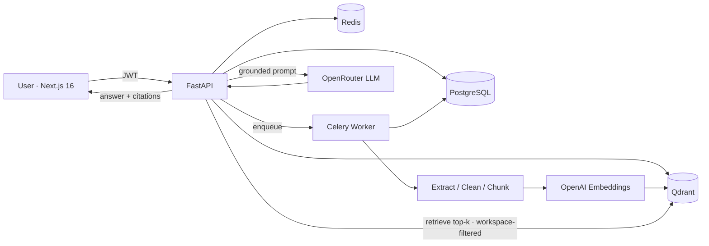

<div align="center">

# DOC-007-AI

**A multi-tenant AI Knowledge Base for businesses.**
Upload your documents, ask questions in natural language, and get answers that are **grounded in — and cited from — your own sources.**

[](https://github.com/sanmaxdev/doc-007-ai/actions/workflows/ci.yml)


</div>

---

## Overview

DOC-007-AI is a production-style **RAG (Retrieval-Augmented Generation)** SaaS. Teams upload policies, SOPs, contracts, reports, and manuals; members ask natural-language questions; the AI answers **only** from the uploaded documents and returns citations (document name, page, and a source snippet). If the answer isn't in the documents, it says so instead of making something up.

It's built as a real product, not a demo: multi-tenant workspaces with strict isolation, role-based access, an asynchronous document-processing pipeline with a visible status state machine, and a swappable AI-provider layer.

## The problem it solves

Teams drown in documents, and generic chatbots hallucinate. DOC-007-AI gives teams **grounded, verifiable, workspace-isolated** answers from their own knowledge base — with the access control, processing pipeline, and audit trail a business actually needs.

## Key features

- 🔐 **Auth & RBAC** — JWT (access + refresh), argon2 password hashing, workspaces with owner/admin/member roles
- 🏢 **Multi-tenant isolation** — enforced at the SQL layer **and** the vector store (every search is workspace-filtered); cross-tenant requests return `404`, not `403`, so existence isn't leaked
- 📄 **Document management** — upload PDF / TXT / MD / DOCX, validation, tags-ready metadata, search, reprocess, delete
- ⚙️ **Async ingestion pipeline** — `extract → clean → chunk → embed → store`, with a live status state machine (`uploaded → extracting → chunking → embedding → ready | failed`) and graceful failure capture
- 🔎 **Vector search** — Qdrant with mandatory per-workspace filtering and top-k retrieval
- 💬 **Grounded Q&A with citations** — answers cite document, page, and snippet; a confidence/coverage indicator; a strict "not found in your documents" fallback
- 🛡️ **Prompt-safety layer** — grounded system prompt; retrieved chunks are treated as untrusted data (prompt-injection defense), never as instructions
- 🔌 **Swappable providers** — OpenRouter (LLM) + OpenAI (embeddings), each with a deterministic **mock** so the whole app runs and tests without any API key
- 📊 **Dashboard** — documents, conversations, members, recent activity
- 🐳 **Dockerized** — one `docker compose up` brings up the full stack

## Screenshots

> Add screenshots to `screenshots/` and they'll render here.

| Dashboard | Documents | Chat with citations |
|---|---|---|
|  |  |  |

## Architecture



**Backend layering is enforced:** thin routers → services (business logic) → `rag/` (extraction · chunking · embeddings · vector store · retrieval · prompt · answer) and `providers/` (LLM + embeddings). No business logic or LLM calls live in routers.

## Tech stack

| Layer | Tech |
|---|---|
| Frontend | Next.js 16 (App Router), React 19, TypeScript, Tailwind CSS, shadcn-style UI, TanStack Query, Zustand |
| Backend | FastAPI, SQLAlchemy 2.0 (async), Alembic, Pydantic v2 |
| Data | PostgreSQL 16, Qdrant (`VECTOR_DIM=1536`), Redis |
| Background jobs | Celery + Redis |
| AI | OpenRouter (LLM, e.g. `gpt-4o-mini`), OpenAI `text-embedding-3-small` (embeddings) |
| Infra | Docker Compose, GitHub Actions (ruff · mypy · pytest · eslint · tsc · build) |

## Getting started (local)

**Prerequisites:** Docker + Docker Compose.

```bash
# 1. Configure environment
cp .env.example .env
#    then add your OPENROUTER_API_KEY and OPENAI_API_KEY (see below)

# 2. Bring up the full stack (postgres, redis, qdrant, api, worker, web)
docker compose up --build

# 3. Apply database migrations (first run)
docker compose exec api alembic upgrade head

# 4. Open
#    App:       http://localhost:3000
#    API docs:  http://localhost:8000/docs
```

Register an account, create a workspace, upload a document, watch it reach **Ready**, then ask questions on the Chat page.

> **No API keys?** The app still runs end to end using built-in **mock** providers — uploads process and the UI works — but answers will return the "not found" fallback because mock embeddings aren't semantically meaningful. Add real keys for genuine grounded answers.

## Environment variables

See [`.env.example`](.env.example) for the full, documented list. The important ones:

| Variable | Description |
|---|---|
| `DATABASE_URL` | Async Postgres URL (`postgresql+asyncpg://…`) |
| `REDIS_URL`, `CELERY_BROKER_URL`, `CELERY_RESULT_BACKEND` | Redis / Celery |
| `QDRANT_URL`, `VECTOR_DIM` | Vector store (dim must match the embedding model; 1536 for `text-embedding-3-small`) |
| `JWT_SECRET_KEY` | Token signing secret (`openssl rand -hex 32`) |
| `OPENROUTER_API_KEY`, `LLM_MODEL` | LLM (generation) — server-side only |
| `OPENAI_API_KEY`, `EMBEDDING_MODEL` | Embeddings — server-side only |
| `CHUNK_SIZE_TOKENS`, `CHUNK_OVERLAP_TOKENS`, `RETRIEVAL_TOP_K`, `RETRIEVAL_MIN_SCORE` | RAG tuning |
| `MAX_UPLOAD_MB`, `STORAGE_LOCAL_PATH` | Upload limits / storage |

**API keys are server-side only and are never exposed to the frontend.**

## Document processing flow

```
upload → validate (type + size) → store file → row created (status=uploaded) → enqueue
worker:  extracting → chunking → embedding → ready        (failures → failed, with the error)
```

The status is persisted at each step so the UI can follow progress live, and the pipeline is idempotent (reprocess clears prior chunks/vectors first).

## RAG pipeline

**Query:** embed the question → Qdrant search filtered by `workspace_id` (top-k) → **guardrail** (if the best match is below the relevance threshold, return "not found" without calling the LLM) → build a safe prompt → LLM → parse `[n]` citations → map back to source chunks → persist conversation, messages, and citations.

**Prompt safety:** grounding and citation rules live in the system role. Retrieved chunks are wrapped in a `<context>` block and explicitly marked as untrusted reference data, so document content can never override the instructions (prompt-injection defense). Document text never enters the system role.

## API

Interactive docs at `http://localhost:8000/docs`. A minimal flow with `curl`:

```bash
# Register + login
curl -s localhost:8000/api/v1/auth/register -H 'content-type: application/json' \
  -d '{"email":"you@co.com","password":"password123"}'
TOKEN=$(curl -s localhost:8000/api/v1/auth/login -H 'content-type: application/json' \
  -d '{"email":"you@co.com","password":"password123"}' | jq -r .access_token)

# Create a workspace
WID=$(curl -s localhost:8000/api/v1/workspaces -H "authorization: Bearer $TOKEN" \
  -H 'content-type: application/json' -d '{"name":"Acme"}' | jq -r .id)

# Upload a document
curl -s localhost:8000/api/v1/workspaces/$WID/documents \
  -H "authorization: Bearer $TOKEN" -F file=@handbook.pdf

# Ask a question
curl -s localhost:8000/api/v1/workspaces/$WID/chat/ask \
  -H "authorization: Bearer $TOKEN" -H 'content-type: application/json' \
  -d '{"question":"How many vacation days do we get?"}'
```

## Security notes

- **Tenant isolation** at three layers: workspace-scoped SQL queries, a mandatory `workspace_id` filter on every Qdrant search, and membership checks on every request (returning `404` to avoid leaking existence).
- **Prompt-injection defense:** retrieved document text is treated as untrusted data, never as instructions.
- **File validation** by type/extension and size; **argon2id** password hashing; JWT access + refresh.
- API keys are **server-side only**; secrets are never committed (`.env` is gitignored, `.env.example` documents the shape).

## Testing

```bash
cd apps/api && pytest          # backend: auth, isolation, chunking, ingestion, RAG
cd apps/web && npm run lint && npm run typecheck && npm run build
```

Coverage includes the security-critical **workspace isolation** tests, the ingestion pipeline (with a fake vector store + mock embeddings), and the RAG answer path including citation mapping and the not-found guardrail.

## Project status & roadmap

**MVP complete** — the full loop works: upload → process → ask → cited answer, workspace-isolated.

- [x] **Phase 0** — Foundation (monorepo, Docker, CI, healthchecks)
- [x] **Phase 1** — Auth + workspaces + RBAC
- [x] **Phase 2** — Documents + async ingestion pipeline
- [x] **Phase 3** — RAG Q&A with citations
- [ ] **Phase 4** — Email invitations, full role enforcement, audit logs, tags, answer feedback
- [ ] **Phase 5** — RAG debug/eval mode (retrieved chunks + scores), hybrid search + reranking
- [ ] **Phase 6** — Public API + API keys, usage quotas, rate limiting
- [ ] **Phase 7** — SSO, streaming answers, advanced analytics

## License

[MIT](LICENSE)
