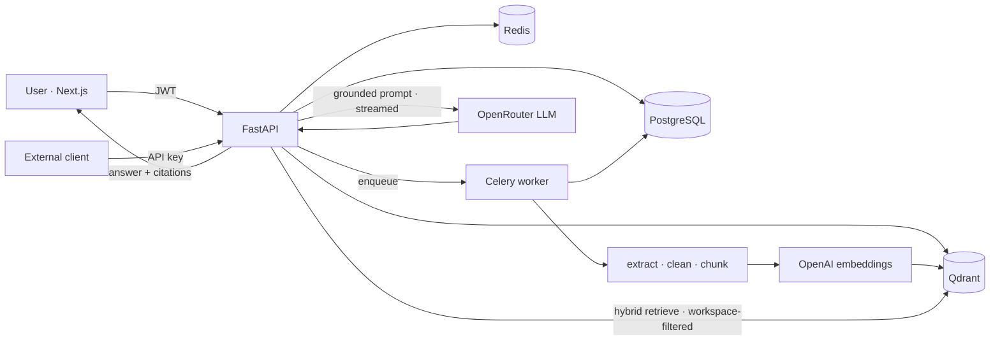
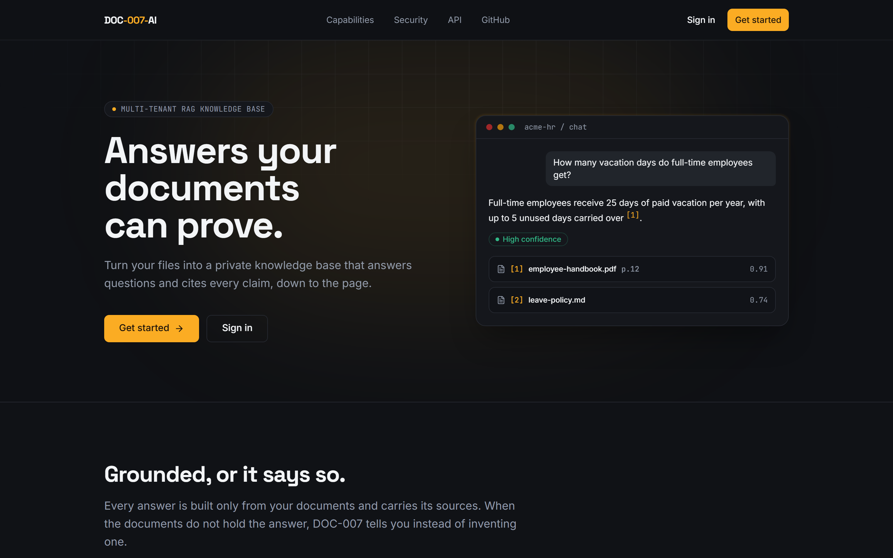
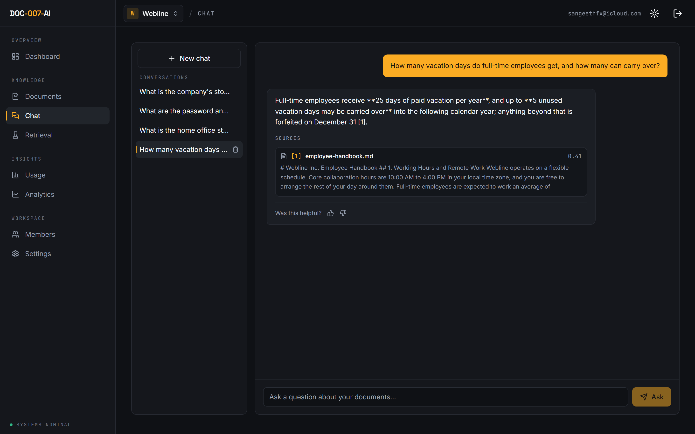
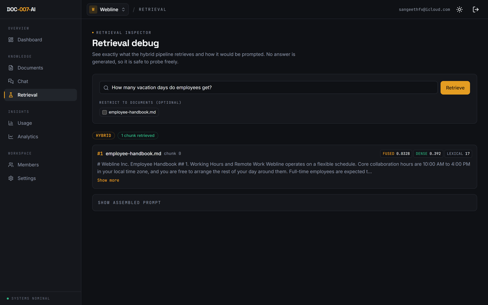
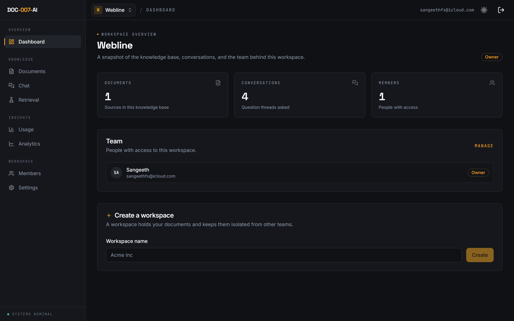
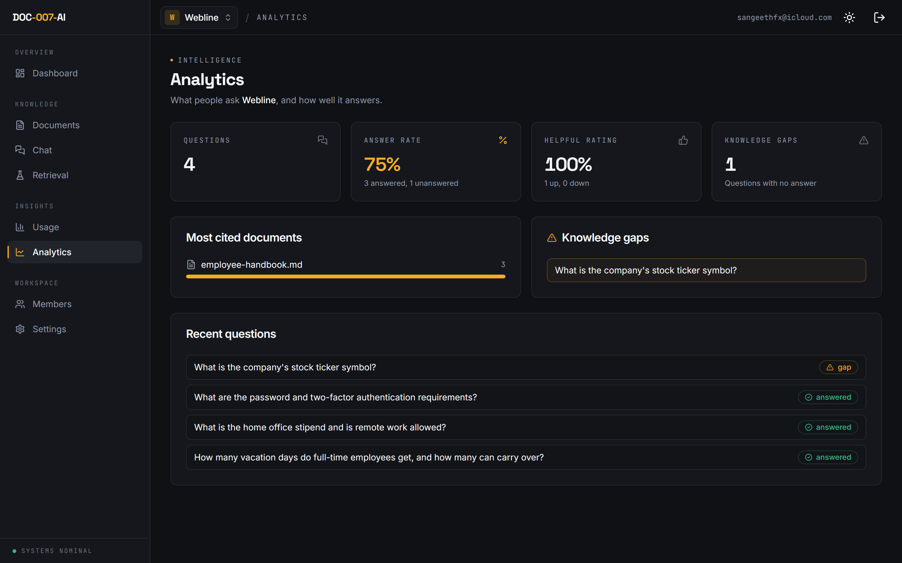
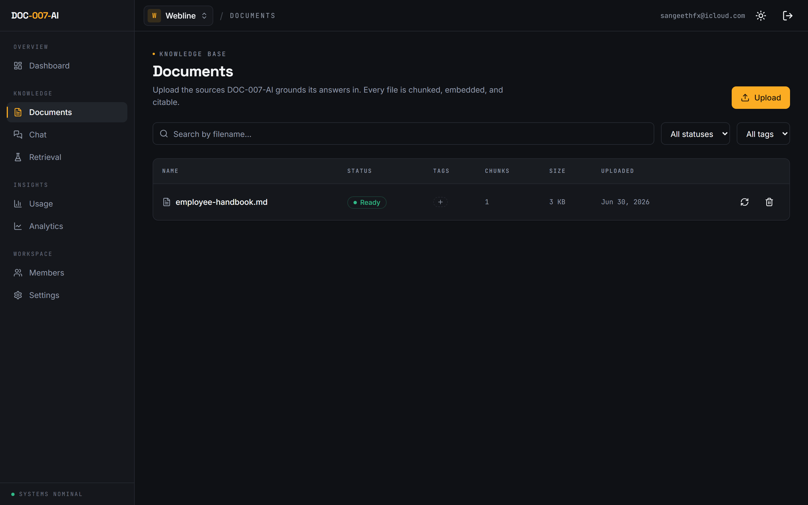
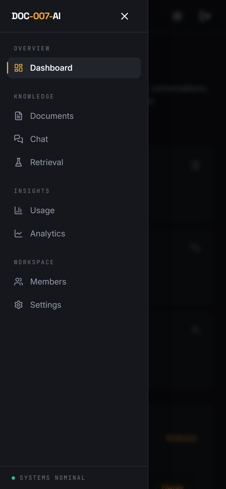

<div align="center">

# DOC-007-AI

**A multi-tenant AI knowledge base for businesses.**
Upload your documents, ask questions in plain language, and get answers that are grounded in (and cited from) your own sources.

[](https://github.com/sanmaxdev/doc-007-ai/actions/workflows/ci.yml)


</div>

---

## Overview

Teams drown in documents, and generic chatbots make things up. DOC-007-AI is a production-style **RAG** platform that answers questions using only a workspace's own documents and cites every claim with its document, page, and snippet. If the answer isn't there, it says so instead of guessing.

It is built like a real SaaS, not a demo: multi-tenant workspaces with strict isolation, role-based access, an asynchronous ingestion pipeline with a visible status machine, hybrid retrieval with an inspectable debug view, a swappable AI-provider layer, a rate-limited public API with usage quotas, and workspace analytics.

## Highlights

| Area | What's inside |
|---|---|
| **Auth & RBAC** | JWT (access + refresh), argon2 hashing, Google and GitHub SSO, owner / admin / member roles, email invitations |
| **Isolation** | Workspace-scoped on every query, plus a mandatory `workspace_id` filter on every vector search. Cross-tenant requests return `404`, not `403` |
| **Documents** | PDF / TXT / MD / DOCX upload, validation, tags, search and filters, reprocess, per-document chunk view |
| **Ingestion** | Async `extract, clean, chunk, embed, store` with a live status state machine and graceful failure |
| **Retrieval** | Hybrid: dense vectors (Qdrant) plus lexical keywords, fused with Reciprocal Rank Fusion |
| **Q&A** | Grounded answers streamed token-by-token, with citations, a coverage indicator, conversation history, and a strict "not found" fallback |
| **Debug / eval** | A retrieval view showing each chunk's dense, lexical, and fused scores and the exact assembled prompt |
| **Prompt safety** | Grounded system prompt. Retrieved chunks are treated as untrusted data (prompt-injection defense) |
| **Team** | Invitations, role management, audit logs, helpful / not-helpful feedback |
| **Public API** | `/api/public/v1` authenticated by API keys, rate-limited per key |
| **Usage & quotas** | A usage ledger (tokens and cost) and an enforceable monthly question limit per workspace |
| **Analytics** | Answer rate, knowledge gaps, most-cited documents, and feedback trends |
| **Ops** | One `docker compose up` for dev, production Docker images + a prod compose, Alembic migrations, GitHub Actions CI |

## Architecture



Layering is enforced on the backend. Thin routers call services (business logic), which call `rag/` (extraction, chunking, embeddings, vector store, retrieval, prompt, answer) and `providers/` (LLM and embeddings). No business logic or model calls live in routers.

## Tech stack

| Layer | Tech |
|---|---|
| Frontend | Next.js 16 (App Router), React 19, TypeScript, Tailwind CSS, TanStack Query, Zustand |
| Backend | FastAPI, SQLAlchemy 2.0 (async), Alembic, Pydantic v2 |
| Data | PostgreSQL 16, Qdrant (`VECTOR_DIM=1536`), Redis |
| Jobs | Celery + Redis |
| AI | OpenRouter (LLM) and OpenAI `text-embedding-3-small` (embeddings). Both swappable, both with deterministic mocks |
| Infra | Docker Compose, GitHub Actions (ruff, mypy, pytest, eslint, tsc, build) |

## Screenshots

Grounded, cited answers streamed in real time, plus a retrieval inspector that shows exactly why.



| Chat with citations | Retrieval inspector |
|---|---|
|  |  |

| Dashboard | Analytics |
|---|---|
|  |  |

| Documents | Mobile |
|---|---|
|  |  |

## Getting started

**Prerequisites:** Docker and Docker Compose.

```bash
# 1. Configure
cp .env.example .env
#    add OPENROUTER_API_KEY and OPENAI_API_KEY

# 2. Bring up the stack (postgres, redis, qdrant, api, worker, web)
docker compose up --build

# 3. Apply migrations (first run)
docker compose exec api alembic upgrade head

# 4. Open
#    App:       http://localhost:3000
#    API docs:  http://localhost:8000/docs
```

Register, create a workspace, upload a document, watch it reach **Ready**, then ask questions.

**Optional SSO.** Set `GOOGLE_CLIENT_ID` / `GOOGLE_CLIENT_SECRET` or `GITHUB_CLIENT_ID` / `GITHUB_CLIENT_SECRET` and a "Continue with Google / GitHub" button appears on the sign-in page. With nothing set, SSO is simply hidden. Register the redirect URI `http://localhost:3000/oauth/<provider>/callback` with the provider.

> **No API keys?** The app still runs end to end with built-in mock providers, but answers fall back to "not found" because mock embeddings aren't semantically meaningful. Add real keys for genuine grounded answers.

## How it works

**Ingestion.** An upload is validated, stored, and recorded as `uploaded`, then a Celery job runs the pipeline and persists the status at each step so the UI can follow along:

```
uploaded → extracting → chunking → embedding → ready          (any failure → failed, with the reason)
```

**Retrieval is hybrid.** A dense vector search (semantic) and a lexical keyword scan (exact terms, names, and IDs a dense model can miss) run in parallel and are merged with Reciprocal Rank Fusion. A query is answered only when there is a strong semantic match or a literal keyword match, otherwise the system refuses rather than hallucinate.

**Answering.** The question is embedded, retrieval runs, and a guardrail decides whether to proceed. If it does, retrieved chunks are wrapped in a `<context>` block (marked as untrusted reference data) and sent with a grounded system prompt. The answer streams back token-by-token over Server-Sent Events, and the model must cite sources with `[n]` markers, which are mapped back to documents for the citation cards.

The **Retrieval debug** page exposes all of this: the ranked chunks, their dense, lexical, and fused scores, and the exact prompt that would be sent, all without calling the LLM. The **Analytics** page turns the conversation history into answer rate, knowledge gaps (questions with no grounded answer), most-cited documents, and feedback trends.

## Public API

A separate, API-key-authenticated surface at `/api/public/v1`, rate-limited per key. Create keys in **Settings** (admin only). Only a hash is stored and the raw key is shown once.

```bash
KEY="doc7_..."   # created in the dashboard

# List documents
curl -s http://localhost:8000/api/public/v1/documents \
  -H "authorization: Bearer $KEY"

# Upload a document
curl -s http://localhost:8000/api/public/v1/documents \
  -H "authorization: Bearer $KEY" -F file=@handbook.pdf

# Ask a question
curl -s http://localhost:8000/api/public/v1/ask \
  -H "authorization: Bearer $KEY" -H 'content-type: application/json' \
  -d '{"question":"How many vacation days do we get?"}'
```

Every question is recorded in a usage ledger (prompt and completion tokens plus estimated cost) and counts toward the workspace's monthly question limit, which is enforced before any tokens are spent.

## Security

- **Tenant isolation** at three layers: workspace-scoped SQL, a mandatory `workspace_id` filter on every Qdrant search, and per-request membership checks that return `404` so existence isn't leaked.
- **Prompt-injection defense.** Retrieved document text is treated as data, never as instructions.
- **Secrets.** Passwords hashed with argon2id. API keys and invitation tokens stored only as SHA-256 hashes and shown once. Provider keys are server-side only.
- **Session control.** JWT logout and refresh revoke tokens through a Redis denylist, and refresh tokens are single-use (rotated on every refresh), so logout and credential compromise take effect immediately.
- **Abuse controls.** Per-IP rate limiting on the auth endpoints, per-key rate limiting on the public API, and per-workspace question quotas. List endpoints are paginated.
- **Audit trail.** Uploads, deletes, invites, role changes, and key lifecycle are recorded.
- **Startup safety.** The API refuses to boot outside development with a default or weak `JWT_SECRET_KEY`, or with debug enabled.

## Testing

```bash
cd apps/api && pytest                 # 62 tests
cd apps/web && npm run lint && npm run typecheck && npm run build
```

Coverage includes the security-critical **workspace isolation** tests, the ingestion pipeline, hybrid retrieval and the not-found guardrail, RBAC and invitations, the public API and rate limiter, quota enforcement, streaming answers, analytics, and SSO sign-in.

## Deployment

Production images and a separate prod compose file are included. Build the web image from the Next.js standalone output and run the API under gunicorn with uvicorn workers; the datastores stay unpublished and the API applies migrations on start.

```bash
# single VM, behind a TLS reverse proxy
docker compose -f docker-compose.prod.yml up -d --build
```

See [DEPLOY.md](DEPLOY.md) for the full guide, including a split managed setup (web on Vercel, API on a container host, managed Postgres and Redis, Qdrant Cloud) and the production hardening checklist.

## Roadmap

- [x] **Phase 0:** Foundation (monorepo, Docker, CI, healthchecks)
- [x] **Phase 1:** Auth, workspaces, RBAC
- [x] **Phase 2:** Documents and the async ingestion pipeline
- [x] **Phase 3:** RAG Q&A with citations
- [x] **Phase 4:** Invitations, role management, audit logs, tags, answer feedback
- [x] **Phase 5:** Hybrid retrieval, a RAG debug/eval view, document detail
- [x] **Phase 6:** Public API, API keys, rate limiting, usage quotas
- [x] **Phase 7:** Streaming answers, workspace analytics, and SSO (Google and GitHub)

## License

[MIT](LICENSE)
