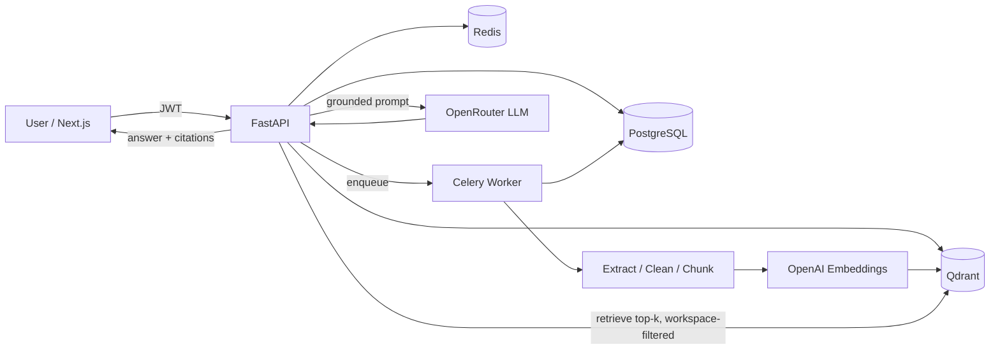

<div align="center">

# DOC-007-AI

**A multi-tenant AI Knowledge Base for businesses.**
Upload documents, organize them by workspace, and ask questions — every answer is grounded in and cited from your own documents.

</div>

---

## Overview

DOC-007-AI is a production-style SaaS RAG (Retrieval-Augmented Generation) platform. Companies upload policies, SOPs, contracts, reports, and manuals; team members ask natural-language questions; the AI answers **only** from the uploaded documents and includes citations (document name, page, and source snippet). If the answer isn't in the documents, it says so instead of hallucinating.

## The problem it solves

Teams drown in documents, and generic chatbots hallucinate. DOC-007-AI gives teams **grounded, verifiable, workspace-isolated** answers from their own knowledge base — with the access control, audit trail, and processing pipeline a real business needs.

## Key features

- 🔐 **Auth & RBAC** — JWT auth, workspaces with owner/admin/member roles, email invitations
- 🏢 **Multi-tenant workspaces** — strict isolation at the SQL **and** vector-store layers
- 📄 **Document management** — upload PDF/TXT/MD (DOCX later), tags, status, search/filter
- ⚙️ **Async ingestion pipeline** — extract → clean → chunk → embed → store, with a visible status state machine
- 🔎 **Vector search** — Qdrant with mandatory per-workspace filtering and top-k retrieval
- 💬 **Grounded Q&A with citations** — answers cite document, page, and snippet; "not found" fallback
- 🛡️ **Prompt-safety layer** — grounded system prompt + prompt-injection defenses
- 📊 **Dashboard & usage** — documents, chunks, questions, storage, failed jobs
- 🧪 **RAG eval/debug mode** — inspect retrieved chunks + similarity scores; feedback buttons

> Full feature scope, roadmap, and design rationale live in [`docs/TECHNICAL_PLAN.md`](docs/TECHNICAL_PLAN.md).

## Tech stack

| Layer | Tech |
|---|---|
| Frontend | Next.js 16 (App Router), React 19, TypeScript, Tailwind CSS, shadcn/ui, TanStack Query, Zustand |
| Backend | FastAPI, SQLAlchemy 2.0 (async), Alembic, Pydantic v2 |
| Data | PostgreSQL 16, Qdrant (`VECTOR_DIM=1536`), Redis |
| Jobs | Celery + Redis |
| AI | OpenRouter (LLM), OpenAI `text-embedding-3-small` (embeddings) |
| Infra | Docker Compose |

## Architecture



## Getting started (local)

**Prerequisites:** Docker + Docker Compose.

```bash
# 1. Configure environment
cp .env.example .env
#   then add your OPENROUTER_API_KEY and OPENAI_API_KEY

# 2. Boot the stack (postgres, redis, qdrant, api, worker, web)
docker compose up --build

# 3. Open
#   Frontend:    http://localhost:3000
#   API docs:    http://localhost:8000/docs
#   Health:      http://localhost:8000/healthz
```

Database migrations (run once the stack is up):

```bash
docker compose exec api alembic upgrade head
```

### Local dev without Docker (API)

```bash
cd apps/api
python -m venv .venv && . .venv/Scripts/activate   # Windows
pip install -e ".[dev]"
uvicorn doc007.main:app --reload
```

### Local dev without Docker (Web)

```bash
cd apps/web
npm install
npm run dev
```

## Environment variables

See [`.env.example`](.env.example) for the full, documented list. Key ones: `DATABASE_URL`, `REDIS_URL`, `QDRANT_URL`, `VECTOR_DIM`, `JWT_SECRET_KEY`, `OPENROUTER_API_KEY`, `OPENAI_API_KEY`. **API keys are server-side only and never exposed to the frontend.**

## Security notes

- **Tenant isolation** is enforced at the SQL layer (workspace-scoped queries + membership checks) **and** the vector layer (every Qdrant search carries a mandatory `workspace_id` filter).
- Uploaded files are validated by type/MIME and size.
- Retrieved document chunks are treated as **data, not instructions** (prompt-injection defense).
- Important actions are recorded in audit logs.

## Project status

🚧 Under active construction. Current: **Phase 0 — foundation scaffold.** See the phased roadmap in [`docs/TECHNICAL_PLAN.md`](docs/TECHNICAL_PLAN.md).

## License

MIT (planned).
