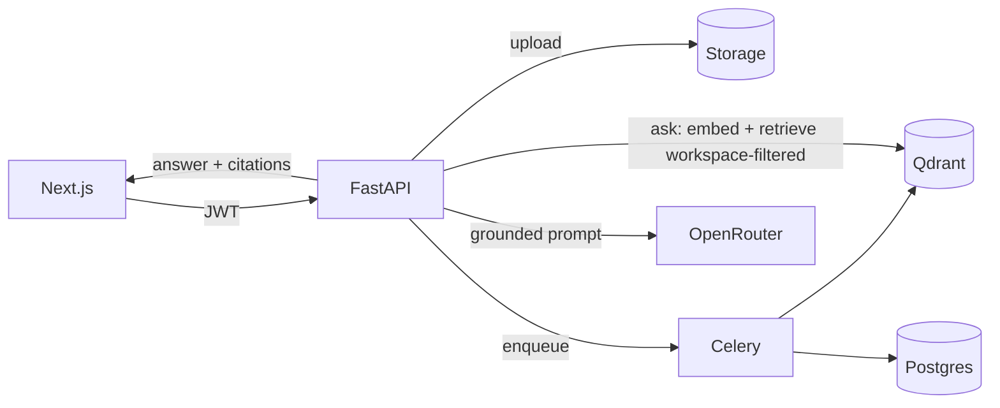

# Architecture

> Summary doc. The full design rationale, schema, API plan, and RAG pipeline live in
> [`TECHNICAL_PLAN.md`](TECHNICAL_PLAN.md).

## Services (docker-compose)

| Service | Role |
|---|---|
| `web` | Next.js 14 frontend (App Router) |
| `api` | FastAPI app — auth, workspaces, documents, RAG Q&A |
| `worker` | Celery worker — async ingestion pipeline |
| `postgres` | Relational store (users, workspaces, documents, chunks, chats, citations, audit) |
| `qdrant` | Vector store (`doc_chunks`, `VECTOR_DIM=1536`), workspace-filtered search |
| `redis` | Celery broker/result backend + cache/rate-limit |

## Backend layering (enforced)

```
api/v1/routers/   thin HTTP layer — no business logic
      │
services/         business logic (auth, workspace, document, chat, usage, audit)
      │
rag/              extraction · cleaning · chunking · embeddings · vector_store · retrieval · prompt · answer
providers/        LLMProvider (OpenRouter)  ·  EmbeddingProvider (OpenAI)
db/ · storage/    persistence + file storage abstraction
```

## Request → answer (high level)


